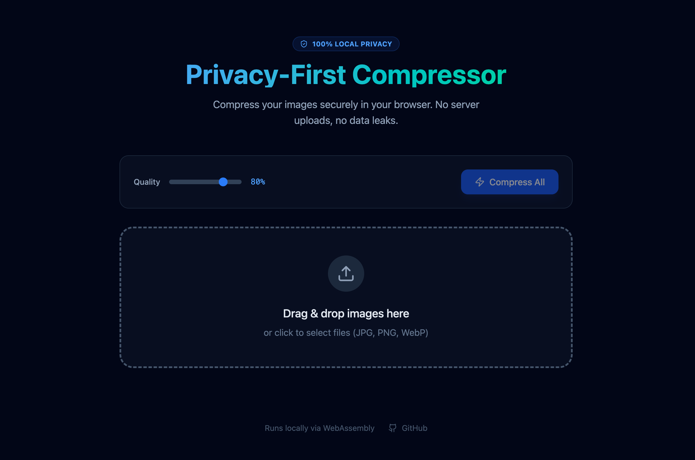

<div align="center">

  # 🛡️ Local-Image-Compressor
  
  **Secure, Serverless, and Blazing Fast Image Compression.**
  <br>
  **拒绝云端上传。基于浏览器本地的高性能图片压缩工具。**

  [](https://github.com/xingchengzhu/local-image-compressor)
  
  
  
  [**🚀 Live Demo / 在线体验**](https://local-image-compressor.vercel.app)
  
  <br>
</div>

---



## 📖 Introduction (简介)

**Stop sending your private photos to the cloud.**

Unlike traditional online tools that require you to upload images to their servers, **Local-Image-Compressor** processes everything locally in your browser using modern WebAssembly technology. Your photos never leave your device.

**拒绝将私密照片发送到云端。**

不同于传统的在线工具需要上传图片到服务器，**PLocal-Image-Compressor** 利用现代 WebAssembly 技术，直接在您的浏览器内完成所有处理。您的照片从未离开过您的设备，绝对安全。

## ⚡ How it Works (工作原理)

It combines the accessibility of a Web App with the privacy of a Desktop App.


* **Zero Latency:** No upload/download waiting time.
* **Offline Capable:** Works perfectly even without internet connection.
* **Batch Processing:** Compress hundreds of images at once.

## ✨ Features (功能亮点)

* **🔒 100% Privacy:** No server uploads, no data collection.
* **🚀 Blazing Fast:** Powered by multi-threaded Web Workers.
* **📦 Batch & Zip:** Auto-zip multiple compressed images for easy download.
* **🎛️ Customizable:** Adjustable quality settings (0.1 - 1.0).
* **📱 Responsive:** Works on Desktop, Tablet, and Mobile.

## 📦 Getting Started

1. **Clone the repository**
```bash
git clone [https://github.com/xingchengzhu/local-image-compressor.git](https://github.com/xingchengzhu/local-image-compressor.git)
cd local-image-compressor

```


2. **Install dependencies**
```bash
npm install

```


3. **Run development server**
```bash
npm run dev

```


## 🛠️ Tech Stack

* **Framework:** React 19 + Vite
* **Styling:** Tailwind CSS v4
* **Core Logic:** `browser-image-compression` (Canvas/WASM)
* **Animation:** Framer Motion

## 📄 License

MIT License. Feel free to fork and deploy your own private instance.

---

<div align="center">
<sub>Built with ❤️ by <a href="https://github.com/xingchengzhu">Xingcheng Zhu</a></sub>
</div>
